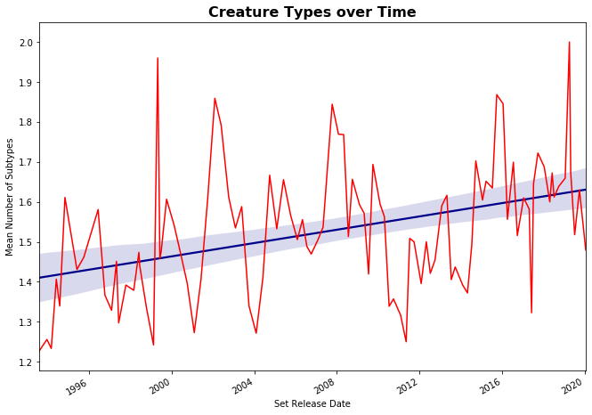

There is always this pervasive idea of "power creep" in games like Magic: the Gathering.

The idea that the power level of game elements increase over time as the creators have to
create new elements that can outcompete old game elements in order to sell their newer product.

<figure class="center-block">
  
  <figcaption align="center"><i>Power creep: the <a href="https://scryfall.com/card/ced/205/kudzu">Kudzu</a> of game design.</i></figcaption>
</figure>

After doing this analysis, I learned that the increase in creature power level was intentional,
as spells were notoriously more powerful than creatures, and the coolest creatures were often the worst.
You can read [this wonderful blog post from 2013](https://magic.wizards.com/en/articles/archive/latest-developments/where-wild-things-are-2013-11-15)
about the idea of creature power level. 

But the information is still interesting to look at (especially with drastic shifts in power level between sets).

## Driving Question:
### Can you visualize the idea of "power creep" in Magic: the Gathering?

The first step was determining how I would measure power level objectively. The most obvious data I had access to was each creature's cost, power and toughness.

I imported my data from a wonderful source called [Magic: The Gathering Developers](https://magicthegathering.io/), using their Python SDK.

<figure class="center-block">
  
  <figcaption align="center"><i>Matplotlib has been a really frustrating boss monster.</i></figcaption>
</figure>

First step was cleaning my data. I didn't care about the text, rulings, or translations,
so I ended up dropping a lot of the columns.
I was also only going to analyze creatures, so I dropped everything that was not a creature.
Finally, I left out a long list of sets that were all reprints or
non-competitive sets without enough unique cards to represent useful sample sizes.

I ended up with a still pretty large dataset even after so many exclusions, with over 10,000 unique cards.

<figure class="center-block">
  
  <figcaption align="center"><i>Some more unique than others.</i></figcaption>
</figure>

The next step was actually creating the data point I would be comparing.
This wasn't very difficult, as I just used the ratio between
the total power and toughness and the converted mana cost of each card.

Then, all I had to do was graph the average of this ratio of every set versus the release date of that set, and a line of best fit for good measure.

## The graphs!

I used the term "Mean Cost Efficiency", which is that average ratio I just mentioned, but it sounds much fancier when even I don't know what it means.

<h5 align="center">Over-all Power Creep</h5>
<figure class="center-block">
  
  <figcaption align="center"><i>Working with Seaborn might be almost as frustrating as vanilla Matplotlib. <b>Almost.</b></i></figcaption>
</figure>

Even without the regression line you can see a pretty consistent trend, which matches what I later learned about creature design from the designers' blog posts.

<figure class="center-block">
  
  <figcaption align="center"><i>Steep creep.</i></figcaption>
</figure>

I wasn't expecting White to have such a big increase,
considering it had some of the best cards of the early days of Magic,
like [Savanna Lions](https://scryfall.com/card/lea/38/savannah-lions) and [Serra Angel](https://scryfall.com/card/lea/39/serra-angel).

<figure class="center-block">
  
  <figcaption align="center"><i>Blue is known best for its spells, but the creatures got better, too.</i></figcaption>
</figure>

One of the things I read about actually was closing the gap between spells and creatures.
It's interesting how far above the line the first sets were considering those are also the sets with the best Blue spells.

<figure class="center-block">
  
  <figcaption align="center"><i>The spike is because of one single card: <a href="https://scryfall.com/card/wwk/57/deaths-shadow">Death's Shadow</a>. It's even played competitively!</i></figcaption>
</figure>

This one might be the most interesting, just based on the consistency. The power level hugs the line of best fit much closer than any of the other colors.

<figure class="center-block">
  
  <figcaption align="center"><i>Red is the color most associated with aggression.</i></figcaption>
</figure>

Honestly, Red probably has the least I can say about it compared to the other colors. It's just... Red.

<figure class="center-block">
  
  <figcaption align="center"><i>Green is unsurprisingly big, and doesn't need that much power creep.</i></figcaption>
</figure>

Green has always had the identity of big, expensive creatures,
so it's not surprising how high it started at the beginning,
and how slow it climbed over the years. If you're wondering,
that low point was from a set where a lot of Green creatures had
zero power and toughness, but entered play with counters that
increased their stats. That isn't accounted for by my data, though,
so it remains an outlier.

<figure class="center-block">
  
  <figcaption align="center"><i><a href="https://scryfall.com/card/mir/315/phyrexian-dreadnought">Colorless creatures</a>: they technically exist.</i></figcaption>
</figure>

## Conclusion

The question I attempted to answer was surprisingly easy to answer. The data had a visible pattern, even without the regression line. Looking at the data for each color gave some interesting insights about color specific power creep.

## Bonus

Due to legal reasons, this graph exists. Do not question it.

<figure class="center-block">
  
  <figcaption align="center"><i><a href="https://scryfall.com/card/tor/138/setons-scout">Seton's Scout</a>: the DM's nightmare.</i></figcaption>
</figure>

As you can see, the average amount of creature types probably increased over time.
But that's just because Wizards of the Coast hasn't errata'd enough cards.