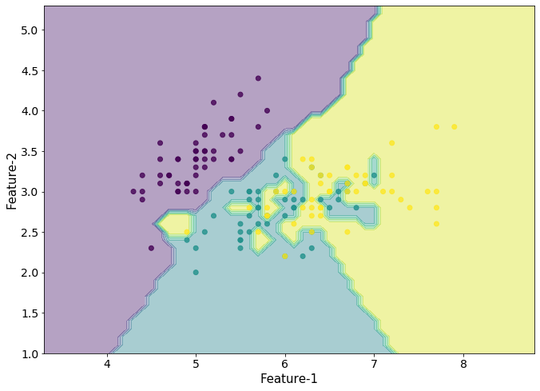

How I did it.

For this project,
I was tasked with building a _k_-Nearest Neighbors algorithm from scratch.

## What is _k_-Nearest Neighbors?
_k_-Nearest Neighbors is what is called "lazy" machine learning,
as no learning is actually done.
A _k_-Nearest Neighbors model just remembers the input data,
and then when the `predict` method is called,
it just checks the distance between the input points and every point in the input data,
then returns the majority class from the _k_ closest points
(hence _k_-Nearest Neighbors) to the input points.

## How it's made

My main references for this project were [this article](https://kevinzakka.github.io/2016/07/13/k-nearest-neighbor/) and [this Geeks for Geeks page](https://www.geeksforgeeks.org/k-nearest-neighbours/).

I used the libraries `pandas` and `numpy`, so we'll start with the import statements.

```python
import numpy as np
import pandas as pd
```

I wrote a simple Euclidian distance function using NumPy's matrix multiplication.
The parameter is just optimization.
This is just the default value for the distance formula.

```python
def distance(pointA, pointB, _norm=np.linalg.norm):
    return _norm(pointA - pointB, axis=1)
```

The constructor method of `KNNeighbors`. _k_ is the number of neighbors,
and formula is the distance formula that will be used to calculate, well,
the distance to each point.

```python
class KNNeighbors:
    def __init__(self, formula=distance, k=1):
        self.formula = distance
        self.k = k
```

The `fit(points, classes)` method accepts both Pandas DataFrames and NumPy arrays.

```python
def fit(self, points, classes):
    try:
        self.points = points.values.reshape(-1, points.shape[1])
        self.classes = classes.values.reshape(-1, 1)
    except:
        self.points = points.reshape(-1, points.shape[1])
        self.classes = classes.reshape(-1, 1)
```
This function is where all the magic happens. I'll break down every line,
because I shoved as much stuff into them as possible.

This line both calls the formula on the point,
and also builds an array with the values arranged like `['x', 'y', 'dist', 'class']`.

```python
def predict(self, point):
    distances = np.hstack((self.points,
                           self.formula(self.points, point).reshape(-1, 1),
                           self.classes))
```
These two lines (I know, I lied) put the array into a Pandas DataFrame,
then sorts the values using Pandas...
because I couldn't figure out how to do it with NumPy.

This sorts the points from closest to farthest.

```python
    distances = pd.DataFrame(data=distances, columns=['x', 'y', 'dist', 'class'])
    distances = distances.sort_values(by='dist')
```

This line takes the closest _k_ values,
and returns the majority classification using Pandas' `value_counts`.

```python
    classification = distances.iloc[:self.k]['class'].value_counts().index[0]

    return classification
```

Now, an interesting comparison between my KNN model and the `sk-learn` KNN model.
My model is slower because I didn't think in 3 dimensions,
so you can only input one point at a time into the `predict` method.

It's astronomically slow calculating the distance for every point,
instead of them all together.

But the real kicker here is...
the `k = 1` decision boundaries are _different_ between my model and `sk-learn`.

I used the function I found <a href="https://towardsdatascience.com/easily-visualize-scikit-learn-models-decision-boundaries-dd0fb3747508">here</a> to visualize the models (modified significantly when working with my model).

I used the Iris dataset, which can be directly found here.

### My classifier
<figure class="center-block">
  
  <figcaption align="center"><i>Decision boundaries with my classifier on the Iris dataset.</i></figcaption>
</figure>

# Scikit Learn's classifier

<figure class="center-block">
  
  <figcaption align="center"><i>Decision boundaries with the Scikit-Learn classifier.</i></figcaption>
</figure>

As you can see, they're almost the same except for some arbitrary differences.

Only a few regions are noticeably changed between the two,
and that might be because I had to edit the visualizing function to display my model.

## Conclusion

My biggest takeaway is I don't understand 3D matrix math.

Alright, that was a lie.
My biggest takeaway is how simple the KNN algorithm really is.

If I were to continue working on this project,
I would implement the Hart algorithm to optimize prediction runtime.
I would also implement inputting any number of points with any number of dimensions.

The full code can be found in the [GitHub](https://github.com/cedro-gasque/CS-Data-Science-Build-Week-1), and as always, thanks for reading.
